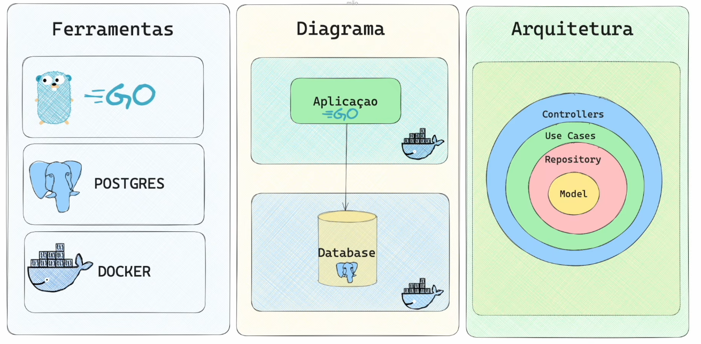
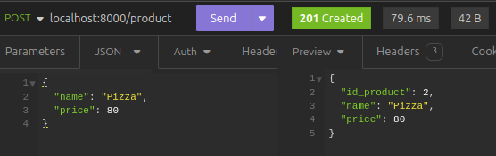
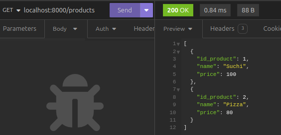
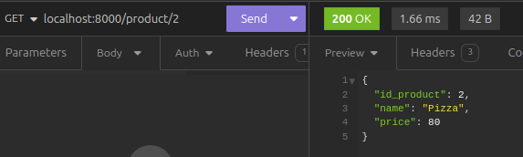

# REST API em Go

### Sumário

1. [Tecnologias Utilizadas](#tecnologias-utilizadas)
2. [Configuração e Execução](#configuração-e-execução)
3. [Estrutura do Código](#estrutura-do-código)
4. [Endpoints](#endpoints)

### Tecnologias Utilizadas
- **Go**  
- **PostgreSQL** 
- **Docker** 

### Configuração e Execução
- Pré-requisitos
    - Docker e Docker Compose instalados
    - Go instalado

- Passos para Configuração
    - Clone o repositório:
    ~~~
    git clone https://github.com/seu-usuario/crud_go.git
    cd crud_go
    ~~~

    - Configure o ambiente Docker:
    ~~~
    docker-compose up --build
    ~~~

    - A aplicação estará disponível em *localhost:8000*.

### Estrutura do Código
- cmd/main.go: Ponto de entrada da aplicação.
- controller/product_controller.go: Contém os controladores que gerenciam as requisições HTTP.
- db/conn.go: Configuração da conexão com o banco de dados.
- model/product.go: Define o modelo do produto.
- repository/product_repository.go: Contém a lógica de acesso ao banco de dados.
- usecase/product_usecase.go: Contém a lógica de negócio da aplicação.

### Endpoints
- **GET** /products: Retorna todos os produtos.
- **POST** /product: Cria um novo produto.
- **GET** /product/{id}: Retorna um produto pelo ID.

